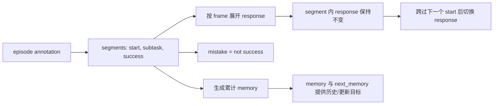
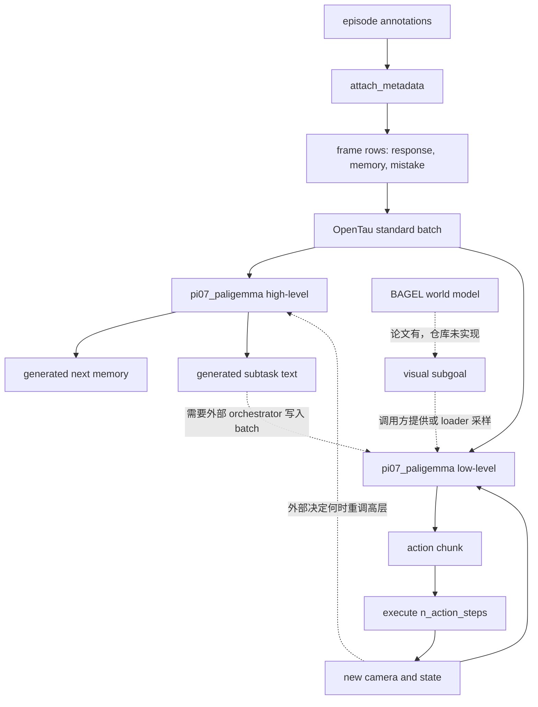

# OpenTau `pi07_paligemma`：训练数据、模型架构与 subtask 闭环分析

> 分析日期：2026-08-03
>
> 本地代码快照：`63634a4662e2adebdc0e57cbf56faa7709cdbbe1`
>
> 官方基线：Physical Intelligence 的 π0.7 论文（arXiv:2604.15483v1）
>
> 分析方法：本地静态代码、配置和测试调用链核对；没有启动训练、GPU 推理、机器人或仿真验证。

## 1. 结论摘要

仓库里容易混淆的其实是三套对象：

1. **官方 π0.7**：论文中的约 5B 模型，核心是 Gemma 3 4B VLM、MEM 式时序视觉编码、约 860M action expert，以及独立高层语言策略和 BAGEL 式视觉世界模型。
2. **当前 `src/opentau/policies/pi07/`**：OpenTau 面向官方结构的新实现，主干已经换成 Gemma 3，默认 448×448、34 层 VLM / 34 层 action expert、5 步去噪；比 `pi07_paligemma` 更接近论文。
3. **兼容实现 `src/opentau/policies/pi07_paligemma/`**：以 PaliGemma 3B/224 配置为骨架的旧版/兼容版，高、低层代码都保留。它实现了很多 π0.7 风格的接口和目标，但**不能直接等同于论文中的原始 π0.7**。

关键判断：

- `pi07_paligemma` 的高层规划器和低层执行器是两套独立 policy，仓库没有把二者自动调度起来的完整 orchestrator。
- 高层训练目标是：给定当前图像、任务、离散化状态、过去 memory 和 episode metadata，生成 `next_memory` 与当前标注的 `response`（subtask）。
- 低层训练目标是：给定观测历史、任务、可选 subtask、metadata、可选 subgoal，联合学习连续 flow-matching 动作和 FAST 离散动作 token。
- 数据中的 subtask 跳转来自离线标注 `segments[].start`；模型没有显式的“subtask 完成/终止”分类头。
- 低层有基于新观测反复重规划 action chunk 的闭环控制，但没有 subtask 成功反馈、critic、reward 或自动调用高层切换 subtask 的机制。
- 仓库支持 `success → mistake` 和累计 `memory` 的**离线结果反馈表达**；这不是在线奖励闭环。
- 两个 benchmark 配置均为 `steps: 0`、`pretrained_path: null`，它们是形状/性能基准，不是论文训练 recipe。
- 高层存在数据契约缺口：标准数据集发出 `memory`，高层 `forward` 却读取 `past_memory`；训练入口中没有找到自动别名转换。
- 官方论文中的 BAGEL 视觉世界模型、异步 subgoal 刷新、metadata CFG 等没有在 `pi07_paligemma` 内形成实现闭环。

## 2. 代码与资料边界

### 2.1 本地关键路径

- 高层配置：[configuration_pi07_high_level.py](../src/opentau/policies/pi07_paligemma/high_level_planner/configuration_pi07_high_level.py)
- 高层模型：[modeling_pi07_high_level.py](../src/opentau/policies/pi07_paligemma/high_level_planner/modeling_pi07_high_level.py)
- 低层配置：[configuration_pi07_low_level.py](../src/opentau/policies/pi07_paligemma/low_level/configuration_pi07_low_level.py)
- 低层模型：[modeling_pi07_low_level.py](../src/opentau/policies/pi07_paligemma/low_level/modeling_pi07_low_level.py)
- PaliGemma + expert 共用骨架：[paligemma_with_expert.py](../src/opentau/policies/pi05/paligemma_with_expert.py)
- 高、低层共用时序视觉编码器：[video_encoder.py](../src/opentau/policies/pi07/video_encoder.py)
- 标准数据格式：[concepts.rst](source/concepts.rst)
- 元数据标注说明：[attach_metadata.rst](source/tutorials/attach_metadata.rst)
- 数据加载与 subgoal 采样：[lerobot_dataset.py](../src/opentau/datasets/lerobot_dataset.py)
- 元数据/记忆生成：[attach_metadata.py](../src/opentau/scripts/attach_metadata.py)、[pi_mem_data_generator.py](../src/opentau/scripts/pi_mem_data_generator.py)
- benchmark 配置：[pi07_paligemma_high_level.json](../configs/benchmarks/pi07_paligemma_high_level.json)、[pi07_paligemma_low_level.json](../configs/benchmarks/pi07_paligemma_low_level.json)

### 2.2 “原始 π0.7”的比较依据

- 官方论文：[π0.7: a Steerable Generalist Robotic Foundation Model with Emergent Capabilities](https://arxiv.org/abs/2604.15483)
- 官方 PDF：[pi07.pdf](https://www.pi.website/download/pi07.pdf)
- 官方公开 `openpi` 仓库核对快照：`15a9616a00943ada6c20a0f158e3adb39df2ccac`。

该 `openpi` 快照的 README 仍只列出 π0 / π0.5 系列 checkpoint，未发现公开的 π0.7 policy 实现或 checkpoint。因此本文“与原始 π0.7 的差异”主要是**对论文架构与运行算法的比较**，不是对官方实现逐行 parity。

## 3. 数据从哪里来：离线标注与标准 batch

### 3.1 episode 级标注格式

`attach_metadata` 接受的核心 annotation 结构可以概括为：

```json
{
  "episode_id": 0,
  "quality": 3,
  "segments": [
    {"start": 0, "subtask": "approach the cup", "success": false},
    {"start": 50, "subtask": "pick up the cup", "success": true}
  ]
}
```

展开规则：

- `quality` 是 episode 级整数，范围 `1..5`。
- `segments` 非空，首段 `start == 0`，随后严格递增。
- `start` 是 **frame index，不是秒数**。
- 每一帧的 `response` 取所在 segment 的 `subtask`。
- 每一帧的 `mistake = not segment.success`。
- `memory` 是对截至当前 segment 的执行历史所生成的累计文本摘要。
- `meta/episodes.jsonl` 额外保存 `quality` 和 segment 起始帧列表。

所以 subtask 标签在一个 segment 内保持不变，只在采样帧跨过下一段 `start` 时发生离散跳转。

### 3.2 通用标准 batch

不使用观测历史时，核心字段为：

| 字段 | 典型形状/类型 | 含义 |
|---|---:|---|
| `cameraK` | `(C,H,W)`, float `[0,1]` | 第 K 路相机图像 |
| `state` | `(max_state_dim,)` | 本体状态，按最大维度补齐 |
| `actions` | `(chunk_size,max_action_dim)` | 动作目标 |
| `prompt` | `str` | 整体任务指令 |
| `response` | `str` | VQA response；有 segment 标注时作为当前 subtask |
| `loss_type` | `"CE"` / `"MSE"` | 样本损失类型标识 |
| `img_is_pad` | `(num_cams,)`, bool | 相机槽位是否 padding |
| `action_is_pad` | `(chunk_size,)`, bool | 动作时间步是否 padding |
| `real_action_dim` | scalar long | 当前数据源的真实动作维数 |
| `obs_history_is_pad` | `(1,)`, bool | 单帧模式恒为 false |

低层使用历史时：

| 字段 | 历史模式形状 |
|---|---:|
| `cameraK` | `(T,C,H,W)` |
| `state` | `(T,max_state_dim)` |
| `obs_history_is_pad` | `(T,)` |

历史帧索引为：

```text
t-(T-1)k, t-(T-2)k, ..., t
```

其中 `k = history_interval`，单位是**数据集 step**。如果配置了 `action_freq`，才可以进一步换算成物理时间。早于 episode 开头的索引会 clamp 到首帧，并由 `obs_history_is_pad=True` 标记。

### 3.3 π0.7 风格可选字段

| 字段 | 类型/形状 | 来源与语义 |
|---|---:|---|
| `memory` | `str` | 当前帧/segment 的累计执行记忆；缺失时为空串 |
| `next_memory` | `str` | `t+1` 帧的 memory，episode 尾部截断到最后一帧 |
| `speed` | scalar long | 同任务内 episode 长度的分位桶，值为 `0,10,...,100`；越低表示越快 |
| `mistake` | scalar bool | 当前 segment 是否失败 |
| `quality` | scalar long | episode 级质量 `1..5` |
| `robot_type` | `str` | 数据集级机器人类型 |
| `control_mode` | `str` | `joint` / `ee` / `mixed` 等控制方式 |
| `fps` | scalar long | 可选；动作 chunk 的有效帧率 |
| `subgoalK` | `(3,H,W)` | 第 K 路相机的单帧未来视觉目标 |
| `subgoal_is_pad` | scalar bool | 所有 subgoal 图像共用的 all-or-none pad 标记 |

数值 metadata 都有对应 `{key}_is_pad`；字符串用空串表示 padding。

### 3.4 subgoal 的实际采样行为

当前 loader 的行为是：

- 默认 `subgoal_drop_prob = 0.75`，即约 25% 样本保留 subgoal。
- 保留时，以 `subgoal_end_of_segment_prob = 0.25` 取 segment 末帧。
- 其余情况在当前时刻到未来约 4 秒之间采样；存在 segment 时不越过当前 segment 边界。
- 每路相机产生对应 `subgoalK`；它始终是单帧，不随 `T` 变成视频。

需要注意一个文档漂移：`docs/source/concepts.rst` 仍写着必须在 `meta/info.json["subgoals"]` 提供路径；当前 `lerobot_dataset.py` 已改为可直接从相机视频特征采样未来帧。此处应以当前代码为准。

### 3.5 默认 prompt dropout

| 条件 | 默认概率 | 效果 |
|---|---:|---|
| `history_state_drop_prob` | `0.30` | 整体遮蔽历史图像和历史状态 |
| `subgoal_drop_prob` | `0.75` | 75% 样本不提供 subgoal |
| `subgoal_end_of_segment_prob` | `0.25` | 已提供 subgoal 时，25% 选 segment 末帧 |
| `response_drop_prob` | `0.30` | 有 subgoal 的样本中，30% 丢弃 subtask 文本 |
| `metadata_drop_all_prob` | `0.15` | 整体丢弃可 dropout 的 metadata |
| `metadata_drop_each_prob` | `0.05` | 分字段独立丢弃 metadata |

这些 dropout 让低层能够在不同 prompt 组合下训练，但“能缺省运行”不等于已经实现论文的 classifier-free guidance。

## 4. 高层规划器训练

### 4.1 数据契约

`PI07PaligemmaHighLevelPolicy.forward()` 实际读取：

```python
{
    "cameraK": Tensor,
    "state": Tensor,
    "prompt": list[str],
    "past_memory": list[str],
    "next_memory": list[str],
    "response": list[str],
    "speed": Tensor,
    "speed_is_pad": Tensor,
    "quality": Tensor,
    "quality_is_pad": Tensor,
    "mistake": Tensor,
    "mistake_is_pad": Tensor,
    "fps": Tensor,          # 可选
    "fps_is_pad": Tensor    # 可选
}
```

高层不预测 action，`select_action()` 与 action-chunk 接口会直接抛出 `NotImplementedError`。

### 4.2 输入与目标序列

高层先把状态每一维 clip 到 `[-1,1]`，再量化到 256 个线性 bin，组成文本：

```text
Task: {task}, Past Memory: {past_memory}, State: {discretized_state},
```

完整训练前缀的逻辑顺序是：

```text
[images]
[task + past memory + discretized state]
[metadata]
[";\n "]
["Updated Memory: "]
[next_memory target]
["Subtask: "]
[response target]
```

图像、语言和 metadata 构成上下文，`next_memory` 与 `response` 是自回归 CE 监督区间。

### 4.3 损失与推理

- `MSE = 0`，只是保持 OpenTau policy 的统一返回接口。
- `CE = memory_ce + response_ce`。
- 推理先自回归生成最多 `memory_max_length` 个 memory token。
- 然后把 `"Subtask: "` 注入 KV cache，再生成最多 `response_max_length` 个 subtask token。
- 当前生成是逐 token greedy `argmax`，不是 beam search 或 sampling policy。

### 4.4 两个数据问题

#### 问题 A：`memory` / `past_memory` 键名不一致

标准 loader 发出 `memory` 和 `next_memory`；高层代码读取 `past_memory` 和 `next_memory`。仓库训练入口、dataset 和 policy wrapper 中未找到 `memory → past_memory` 的自动映射。已有测试/benchmark 是手工构造 `past_memory`。

若要用标准 LeRobotDataset 训练高层，至少需要明确一个适配位置：

```text
batch["past_memory"] = batch["memory"]
```

#### 问题 B：空 target 仍可能监督 EOS

注释称空 `response` / `next_memory` 不应参与 loss；实现却先把空串变成 `"<eos>"` 再 tokenization。pad mask 只遮蔽 padding token，EOS 本身通常仍是真实 token。因此空目标更可能训练“立即结束”，而不是让整个目标不计损失。

若训练集混有无 subtask/memory 标注的数据，应先用 tokenizer 级单测确认这一行为是否符合预期。

### 4.5 高层 benchmark 不是训练 recipe

`configs/benchmarks/pi07_paligemma_high_level.json` 的关键值：

```text
n_obs_steps = 1
image = 3 × 224×224
max_state_dim = 32
prompt_max_length = 64
memory_max_length = 50
response_max_length = 50
freeze_vision_encoder = true
pretrained_path = null
steps = 0
batch_size = 1
```

这只能说明预期输入形状和 benchmark 用法，不代表论文训练预算、初始化权重或完整数据配方。

## 5. 低层执行器训练

### 5.1 数据契约

低层核心输入为：

```python
{
    "cameraK": Tensor,             # (B,T,C,H,W)
    "state": Tensor,               # (B,T,max_state_dim)
    "actions": Tensor,             # (B,chunk_size,max_action_dim)
    "prompt": list[str],
    "action_is_pad": BoolTensor,
    "real_action_dim": LongTensor,
    "obs_history_is_pad": BoolTensor,
    "response": list[str],         # 可选 subtask
    "subgoalK": Tensor,            # 可选未来图像
    "subgoal_is_pad": BoolTensor,
    "speed"/"quality"/"mistake"/...: Tensor,
    "robot_type": list[str],
    "control_mode": list[str],
    "fps": Tensor                  # 可选
}
```

`actions` 有两条并行监督路径：

1. 按 policy 的 action normalization 进入连续 flow-matching 路径。
2. 另按 `MIN_MAX` 归一化后交给 `physical-intelligence/fast`，得到离散 action tokens，用于 CE。

`action_is_pad` 遮蔽 padding 时间步，`real_action_dim` 遮蔽不同机器人之间补齐的动作维度；启用 RTC frozen prefix 时还会附加 prefix mask。

### 5.2 prefix / suffix 结构

低层 VLM prefix 的逻辑顺序为：

```text
[observation video tokens for camera0..K]
[task text]
["State:"]
[one projected state token per history step]
[optional "Subtask:" + response]
[optional metadata]
[optional "Subgoal:" + subgoal images]
[":\n"]
[training only: "Action:" + FAST action tokens]
```

连续动作 action expert 的 suffix 为：

```text
[noisy action tokens + flow timestep embedding]
```

关键 attention 语义：

- 观测与上下文使用 block-causal / block-bidirectional 组织。
- action expert 的动作 token 在自身块内双向注意。
- action expert 可以 cross-attend VLM 上下文。
- `"Action:" + FAST tokens` 被排除在 action expert 的 cross-attention 上下文之外，避免连续动作分支偷看离散动作答案。

### 5.3 双损失与 knowledge insulation

低层返回：

```text
MSE = masked flow-matching velocity loss
CE  = masked FAST discrete-action token cross entropy
```

训练总损失如何加权由外层配置的 `loss_weighting` 决定，不能由模型同时返回 MSE/CE 推断二者固定为 1:1。

连续 action expert 使用 VLM 的 KV/hidden context，但 MSE 路径会阻断 action expert 对 VLM backbone 的反向梯度：

- VLM/FAST 离散 token 分支由 CE 更新。
- 连续动作专家由 flow-matching MSE 更新。
- MSE 不直接把机器人动作梯度灌回通用 VLM。

这保留了论文 knowledge insulation 的核心语义，但是否冻结 vision、只训练 expert 或只训练 vision 仍由配置决定。

### 5.4 观测历史与时序视觉编码

`SpaceTimeSiglipVideoEncoder` 接受 `(B,T,C,H,W)`：

- 每帧走同一个 SigLIP/PaliGemma vision tower。
- 默认 `spacetime_layer_stride=4`，在 27 层视觉 transformer 的第 4、8、12、16、20、24 层（0-based 索引 `3,7,11,15,19,23`）加入时序 attention 计算。
- wrapper 重用原层 Q/K/V/O 权重，只增加非持久化正弦位置编码；**没有新增可训练参数**。
- 输出只保留当前帧的 patch tokens，使 token 数与单帧相同。
- `T=1` 时走单帧兼容路径。

所以“每隔 4 层增加时序注意力”是**修改 6 个既有视觉层的 forward 语义**，不是额外堆 6 个 transformer block。

### 5.5 action chunk 与闭环执行

- 训练始终监督完整 `chunk_size`。
- 推理每次也解码完整 `chunk_size`。
- `select_action()` 只把 `n_action_steps` 个动作放进执行队列。
- 队列耗尽后，用更新后的相机和 state 再推理下一 chunk。
- `max_delay` / action prefix 支持 RTC 式延迟补偿；但 `n_action_steps < chunk_size` 时当前配置校验要求 `max_delay == 0`。

所以低层具有“新观测 → 新 action chunk”的 receding-horizon 控制反馈，但它不判断 subtask 是否完成。

### 5.6 低层 benchmark 不是论文配置

`configs/benchmarks/pi07_paligemma_low_level.json` 的关键值：

```text
n_obs_steps = 6
history_interval = 1 dataset step
image = 3 × 224×224
max_state_dim = 32
max_action_dim = 32
chunk_size = 10
n_action_steps = 10
num_steps = 10
spacetime_layer_stride = 4
pretrained_path = null
steps = 0
batch_size = 1
```

类默认值虽为 `chunk_size=50`、`n_action_steps=50`，benchmark 为节省算力改成了 10。两者都不能当成官方 π0.7 的 `H=50、执行 15/25 步、5 步去噪` 配方。

## 6. 模型架构与新增层数

### 6.1 PaliGemma VLM 主干

| 模块 | 关键规模 |
|---|---|
| PaliGemma text backbone | hidden `2048`，intermediate `16384`，`18` decoder layers |
| SigLIP vision tower | hidden `1152`，intermediate `4304`，`27` layers，patch `14` |
| benchmark 图像 | `224×224`，对应每图 `16×16=256` patch tokens |
| action expert | Gemma hidden `1024`，intermediate `4096`，`18` layers |

模型移除了 action expert 自己的 `embed_tokens` 与 `lm_head`；action token 的输入/输出由 policy 外挂投影负责。

### 6.2 低层新增或改造模块

| 模块 | 数量/形状 | 新增可训练参数 | 作用 |
|---|---:|---:|---|
| Gemma action expert decoder | `18` 层，hidden `1024` | 是 | 连续 flow-matching 动作建模 |
| SpaceTime wrapper | 覆盖 vision 27 层中的 6 层 | 否 | 重用视觉层权重做 temporal attention |
| `state_proj` | `max_state_dim → 2048` | 是 | 每个历史 state 映射为一个 VLM token |
| `action_in_proj` | `max_action_dim → 1024` | 是 | noisy action 进入 expert |
| `action_out_proj` | `1024 → max_action_dim` | 是 | expert hidden 输出速度场 |
| time MLP | 两个 `1024 → 1024` Linear | 是 | flow timestep embedding |
| FAST embedding | `fast_vocab → 2048` | 是 | 离散 action token 输入 |
| FAST head | `2048 → fast_vocab` | 是 | FAST token CE logits |

开启 `per_group_projection` 后，state/action 三个 projection 会变成按 group 选择的 `PerGroupLinear`，但 time MLP 仍共享。

### 6.3 高层携带了无用 expert

高层也构造完整 `PaliGemmaWithExpertModel`，所以注册了 18 层 action expert、FAST embedding 和 FAST head；但高层 forward 始终传入：

```python
inputs_embeds=[prefix_embs, None]
```

即只运行 VLM 流，不运行 action expert。对高层而言，这批 expert 参数是架构继承下来的未使用负担，而不是有效的“新增高层”。

当前 Gemma 3 版 `pi07/high_level_planner` 已提供 `disable_action_expert=True`，不实例化这约 860M 的无用 expert；这是当前版相对 legacy 的重要工程修正。

## 7. 预训练模型与 checkpoint 语义

### 7.1 会读取的外部资产

- 文本 tokenizer：`google/paligemma-3b-pt-224`
- FAST processor/tokenizer：`physical-intelligence/fast`

这两个 ID 说明词表和 action tokenizer 来源，**不代表模型权重已经从这些仓库完整加载**。

### 7.2 默认权重初始化

`pi07_paligemma` 内部以 config 直接构造：

```python
PaliGemmaForConditionalGeneration(config=...)
GemmaForCausalLM(config=...)
```

低层创建共用模型时传入 `load_pretrained_paligemma=False`；benchmark 还设置 `"pretrained_path": null`。因此 benchmark 路径下的 PaliGemma、action expert 和新增投影是随机初始化，不会自动加载 `google/paligemma-3b-pt-224` 模型权重。

### 7.3 `pretrained_path` 应指向什么

`make_policy` 在 `pretrained_path` 非空时走 OpenTau `PreTrainedPolicy.from_pretrained()`，预期目录中有兼容的 policy config/state dict。不能仅凭架构名就把 vanilla Google PaliGemma 仓库 ID 当作完整 `pi07_paligemma` checkpoint；还需处理 action expert、新投影、FAST head 和键名映射。

当前仓库文档把 TensorAuto 的 π0.7 checkpoint 标为尚未发布。当前 `pi07` 提供 legacy warm-start / remap 能力，但“能转换旧 checkpoint”仍不等于已有官方 π0.7 预训练权重。

## 8. subtask 如何跳转

### 8.1 训练数据中的跳转



这里没有额外的 jump label。跳转信号就是分段后的文本标签发生变化。

时间对齐也要分清：

- `response[t]` 是 **t 所在 segment 的当前 subtask**。
- `next_memory[t]` 是 `memory[t+1]`。
- 高层没有使用 `response[t+1]` 作为独立目标。

所以高层学到的是“在当前观测与历史条件下输出该帧应该执行的 subtask”，而不是显式学习 termination probability。

### 8.2 推理时的跳转

每次外部调用高层时，它都可以依据最新图像、task、state 和 `past_memory` 生成新 subtask。若输出和上一次不同，从接口效果上就是发生了跳转。

但模型内部没有：

- 调用频率/定时器；
- 当前 subtask 状态机；
- completed / failed / continue 分类头；
- 对上一次输出做语义比较的逻辑；
- 自动把高层输出传给低层的调度器。

因此“何时再次调用高层”以及“何时接受新 subtask”必须由部署侧 orchestration 决定。

低层只把 `response` 当作可选 prompt block。调用方更新它后，下一次 action-chunk 推理会使用新 subtask；低层自己不会生成、校验或更新它。

### 8.3 相邻 runtime 代码不等于完整闭环

- `high_level_planner_inference.py` 使用外部 `HighLevelPlanner`/云端 VLM 做示例循环，不是调用训练好的 `PI07PaligemmaHighLevelPolicy`。
- `GeminiERPlanner` 的 prompt 会要求模型检查画面，未完成时重复之前 subtask。这属于外部 VLM 的视觉反馈式规划；它没有与 `pi07_paligemma` 高低层 policy 形成统一部署链。

## 9. 到底有没有反馈机制

| 反馈类型 | `pi07_paligemma` 状态 | 说明 |
|---|---|---|
| 低层观测闭环 | **有** | action queue 用完后读取新图像/state，再预测新 chunk |
| RTC 动作前缀反馈 | **部分有** | 有 delay/action-prefix 接口，但 benchmark/default 不是官方运行配方 |
| 高层视觉反馈接口 | **有接口** | 每次调用可输入最新图像/state/memory；没有内置调度器决定重调用 |
| subtask 自动完成检测 | **没有** | 没有 termination/completion head 或状态机 |
| 成功/失败在线反馈 | **没有闭环** | `mistake` 来自离线 segment success，不是在线执行结果回写 |
| 历史结果记忆 | **离线有** | `memory` 可含 SUCCESS/FAILED 历史摘要；高层学习更新 `next_memory` |
| reward / critic / value | **没有** | 该 policy 内没有 RL critic 或 reward feedback |
| 视觉世界模型反馈 | **没有实现** | loader 可提供未来真值 subgoal；没有 BAGEL 世界模型生成和异步刷新 |
| metadata CFG | **没有实现** | 有 prompt dropout/metadata condition，但没有论文式双前向引导 |

最准确的表述是：**低层是视觉-状态闭环控制；高层具备基于新观测重规划的输入接口；但 legacy 高低层还没有形成带完成检测、结果回写和世界模型刷新的端到端 subtask 闭环。**

## 10. 与官方 π0.7、当前 `pi07` 的差异

| 维度 | 官方 π0.7 论文 | `pi07_paligemma` | 当前 `pi07` |
|---|---|---|---|
| VLM 主干 | Gemma 3 4B，含约 400M vision | PaliGemma 3B 配置 | Gemma 3 4B 配置 |
| 总规模 | 约 5B；含约 860M action expert | 未给出同口径规模；18 层/1024 expert | 34 层/1280 expert，目标约 860M |
| 图像分辨率 | 448×448 | benchmark/default 224×224；支持非默认尺寸路径 | 默认 448×448 |
| VLM text layers | Gemma 3 4B 对应结构 | 18 | 34 |
| action expert layers | 约 860M transformer | 18，hidden 1024 | 34，hidden 1280 |
| 高层架构 | 与主策略同类 Gemma 3 架构 | PaliGemma；携带未使用 expert | Gemma 3；可禁用 expert |
| 观测历史 | 每相机最多 6 帧，1 秒 stride | benchmark 6 帧、stride=1 **dataset step** | 同样按 dataset step 配置，默认 6 |
| 相机数量 | 最多 4 路观测；最多 3 路 subgoal | 按 `input_features`；benchmark 3 路 | 按 `input_features` |
| 历史 token 压缩 | MEM encoder，压到单帧 token 数 | 只保留当前帧 patch tokens，达到同 token 数目标 | 同一共享 video encoder |
| state 表达（低层） | 每个历史 state 线性投影为 token | `state_proj → 2048` | `state_proj → 2560` |
| action horizon | 固定 50 | 类默认 50，benchmark 10 | 默认 50 |
| 去噪步数 | 5 | 默认/benchmark 10 | 默认 5 |
| 实际执行 horizon | 15 或 25 | 默认 50，benchmark 10 | 默认 50，可配 |
| RTC 训练 delay | 0..12 step；50 Hz 下最多 240 ms | 有 `max_delay`，默认/benchmark 为 0 | 有对应机制 |
| subtask 来源 | 学习型高层或人工 coaching | 独立高层或调用方提供；无集成调度 | 同样分离 |
| subgoal 来源 | BAGEL 世界模型；真实+生成图混训 | loader 采样真实未来帧；无内置世界模型 | 同样未见 BAGEL 闭环 |
| subgoal 刷新 | subtask 变化或 4 秒到期，异步 | 无内置刷新器 | 无内置刷新器 |
| metadata runtime | speed 任务 p15、quality=5、mistake=false | 能编码 metadata；无统一 runtime preset | 能编码 metadata |
| CFG | metadata 等 prompt 可做 CFG | 未实现 | 未发现等价实现 |
| control mode dropout | 论文明确不丢 control mode | 通用 dropout 会处理 `control_mode` | 同一数据路径 |
| 预训练数据 | 机器人示范、失败/自主数据、egocentric/web/multimodal 等 | 支持数据混合接口；benchmark 不是官方数据配方 | 同理 |
| checkpoint | 论文内部模型 | benchmark 无权重；公开文档无可用 pi07 checkpoint | 文档仍标记 coming soon |

### 10.1 不能只看数值相近就判定一致

- `n_obs_steps=6` 相同，不代表时间跨度相同：论文是 1 秒 stride，本地 benchmark 是 1 个 dataset step。
- `chunk_size=50` 相同，不代表部署节奏相同：论文只执行其中 15/25 步；legacy 默认执行 50。
- 都有 subgoal 字段，不代表都有 world model：本地主要来自轨迹未来真值帧，论文还加入生成图，并在运行时异步生成。
- 都有 dropout，不代表都支持 CFG：CFG 需要 conditional/unconditional score 组合。
- tokenizer 使用 `google/paligemma-3b-pt-224`，不代表模型载入了对应预训练权重。

## 11. 训练与部署链路图



虚线就是当前缺失或依赖外部系统的边界。

## 12. 若要接成真实闭环，最小缺口

1. **统一高层数据键名**：明确 `memory → past_memory` 的唯一适配层，并补数据集级测试。
2. **定义高层调用策略**：固定频率、基于视觉完成判断，或由显式 termination model 触发；当前代码没有答案。
3. **定义状态传递**：高层 decoded `next_memory`、`response` 如何保存并传给下一轮高层/低层。
4. **定义 subtask 接受规则**：文本变化是否立即切换，是否做语义去重，是否允许回退/重试。
5. **定义结果反馈来源**：机器人/环境 success 如何形成新的 `mistake` 或 memory；离线标注不能代替在线信号。
6. **补 subgoal 服务**：若追求论文流程，需要 world model、异步缓存、4 秒/语义变化刷新器，以及生成 subgoal 的分布匹配。
7. **实现或明确放弃 CFG**：prompt dropout 只是训练基础，不会自动产生论文式 CFG。
8. **选择正确模型族**：新工作若目标是论文 π0.7 对齐，应优先审视当前 `pi07`，而不是继续把 `pi07_paligemma` 当作官方架构。
9. **提供真实训练配置**：benchmark 的 `steps=0`、`pretrained_path=null` 不能承担训练 recipe 角色。
10. **验证空目标 mask**：确认无 subtask/memory 样本是否应监督 EOS。

## 13. 最终判断

`pi07_paligemma` 是结构完整度较高的 **π0.7 风格 legacy/compatibility implementation**：

- 数据层能表达 subtask、历史 memory、成功/失败、质量、速度、控制模式、观测历史和未来视觉 subgoal。
- 高层能以 CE 训练“更新 memory + 输出 subtask”。
- 低层能做 MEM 风格时序视觉、state token、prompt conditioning、knowledge insulation、连续 flow matching 和 FAST CE 联合训练。
- 低层 action 控制是闭环的。

但它不是论文系统的完整复刻：

- backbone、规模、分辨率和层数都属于 PaliGemma legacy 路线；
- 默认 checkpoint 未加载；
- 高层标准数据键名尚未直接接通；
- 高低层没有统一运行时调度；
- 没有显式 subtask 完成检测或在线 success feedback；
- 没有 BAGEL 世界模型、生成 subgoal 混训闭环和 metadata CFG。

对“subtask 如何跳转、有没有反馈机制”的最短回答是：

> 训练时，subtask 通过离线 segment 边界切换；推理时，高层每次被外部重调都可能生成新 subtask，低层在下一次 action-chunk 推理时响应它。低层有新观测闭环，高层有新观测输入接口和离线 memory/mistake 监督，但仓库尚无自动完成检测、在线结果回写与高低层调度组成的完整 subtask 闭环。
