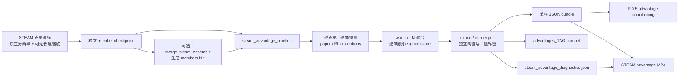

# STEAM 优化修改说明（提交 `5bbf832`）

## 1. 文档范围

本文说明项目当前最新提交：

| 项目 | 内容 |
| --- | --- |
| Commit | `5bbf83213578950b384eaa86ff520a0bedd9a939` |
| 标题 | `Add STEAM advantage visualizer and associated tests` |
| 作者 | `lxy <00771490@zoomlion.com>` |
| 提交时间 | `2026-07-31 08:55:13 +08:00` |
| 父提交 | `305e87670a6ee0d8a95dcc2524748a9884b01e0d` |
| 变更规模 | 23 个文件，新增 2743 行，删除 511 行 |

虽然提交标题强调 advantage 可视化器，但实际改动覆盖了 STEAM 从训练、checkpoint
组织、优势值推理、标签生成、产物落盘到视频诊断的完整链路。核心目标可以概括为：

1. 消除 STEAM 输入分辨率的静默二次缩放，保证视觉输入契约明确。
2. 同时支持论文基线和 RLinf 两套时序分数语义，并让标签规则可配置、可追溯。
3. 将固定三成员 ensemble 扩展为任意 `N >= 1`，支持合并 checkpoint 和分布式打分。
4. 增强训练、数据分布、成员不确定性和 advantage 曲线的可观测性。
5. 在保留旧 JSON 消费接口的同时，增加 Parquet、diagnostics 和 MP4 诊断产物。

> 安全提示：本文中的生产配置包含 16k/30k steps。按照仓库规则，不应在本地直接启动这些
> 训练配置；训练路径验证只能使用仓库允许的 smoke/fake-tensor 配置。

## 2. 改动前后对比

| 维度 | 修改前 | 修改后 | 优化价值 |
| --- | --- | --- | --- |
| 图像分辨率 | 数据侧示例为 `224x224`，模型内部再双线性上采样到 SigLIP 的 `384x384` | 数据与模型必须直接使用视觉塔原生分辨率；不一致立即报错 | 避免先降采样再上采样造成不可逆的信息损失 |
| 时序偏移 | 总是按全局 episode 长度参考缩放 | `length_scale_enabled` 显式控制；可关闭以对齐 RLinf | 将“论文归一化”和“原始 stride”变成可复现实验变量 |
| Ensemble 数量 | 强制三个独立 checkpoint | 任意 `N >= 1`；单成员、多个独立成员、合并 ensemble 均可 | 降低使用约束，支持更灵活的推理部署 |
| Ensemble 聚合 | 基于旧 paper-baseline 分数取逐帧最小值 | 默认使用 RLinf signed score 做 worst-of-N，同时保留 paper 分数 | 明确对齐 RLinf 的保守进度估计语义 |
| 标签阈值 | expert/non-expert 分位数，使用 `>=` | 支持分位数或固定阈值；默认严格 `>`，可选旧式 `>=` | 消除阈值相等样本的语义歧义 |
| 推理并行 | 单进程串行 | 支持 `torchrun` 连续均衡分片和 rank 0 汇总 | 提升大数据集 advantage 生成吞吐 |
| 产物 | 兼容消费者的 JSON bundle | JSON + RLinf 风格 Parquet + 成员 diagnostics | 兼顾向后兼容、分析能力和审计能力 |
| 可视化 | 仅有通用 Streamlit JSON 浏览 | 新增视频与成员/聚合曲线对齐的 MP4 | 可直接检查视觉进度与 advantage 是否同步 |
| 训练观测 | 仅精确分类准确率 | 增加相邻 bin 准确率、目标直方图和全局 batch/sample budget | 更容易定位“方向正确但相差一档”和数据分布问题 |
| 代码结构 | advantage 逻辑集中在单个 400+ 行脚本 | CLI 兼容层与 900+ 行独立流水线模块分离 | 降低入口脚本职责，便于单测和复用 |

## 3. 新的端到端链路



## 4. 详细修改说明

### 4.1 原生分辨率输入：阻止静默上采样

涉及文件：

- `src/opentau/policies/steam/configuration_steam.py`
- `src/opentau/policies/steam/modeling_steam.py`
- `src/opentau/configs/train.py`
- `configs/examples/steam_training_config.json`

`SteamConfig` 新增：

```python
image_resolution: tuple[int, int] = (384, 384)
```

新的分辨率契约分三层校验：

1. `SteamConfig.__post_init__()` 校验分辨率必须包含两个正整数。
2. `TrainPipelineConfig.validate()` 校验
   `policy.image_resolution == TrainPipelineConfig.resolution`。
3. `SteamPolicy` 初始化时读取 image processor 原生尺寸，并校验其等于
   `policy.image_resolution`；`_preprocess_images()` 再校验真实 tensor 的空间尺寸。

旧实现会在 `_preprocess_images()` 内使用 `F.interpolate(..., mode="bilinear")`。当数据已经被
缩放为 `224x224`、而 SigLIP processor 期望 `384x384` 时，模型实际看到的是“先降采样、再上采样”
的图像。新实现删除了这条静默修复路径，配置错误会在训练或推理早期直接暴露。

默认示例同步改为：

```json
"policy": {
    "image_resolution": [384, 384]
},
"resolution": [384, 384]
```

这是一项输入质量和配置安全优化，不代表旧 `224x224` checkpoint 与新输入必然数值等价。
迁移旧 checkpoint 时需要确认其实际训练输入链路，不能只改 JSON 后假定行为不变。

### 4.2 时序标签：长度缩放变为显式开关

涉及文件：

- `src/opentau/policies/steam/configuration_steam.py`
- `src/opentau/datasets/steam_pair_dataset.py`
- `src/opentau/datasets/factory.py`

新增配置：

```python
length_scale_enabled: bool = True
```

目标时序偏移现在按以下方式计算：

```text
signed_offset = frame_tk - frame_t

length_scale_enabled = true:
    scaled_offset = signed_offset * global_length_reference / episode_length

length_scale_enabled = false:
    scaled_offset = signed_offset
```

- `true` 保留原有的 episode 长度归一化语义。
- `false` 使用真实 frame stride，用于 RLinf parity 配置。
- 仅在开关开启时才计算并设置跨训练/验证数据集共享的全局长度参考。

`SteamPairDataset.target_bin_histogram()` 新增了不消耗训练随机数的全量目标统计。它遍历每个
episode 的所有合法 stride，并同时计数正向和反向 pair；每个 stride 的 multiplicity 为
`episode_length - stride`。数据工厂会记录：

- 数据源和 episode 数量；
- episode 长度的 min/median/max；
- 是否启用长度缩放；
- 最终 target-bin 直方图；
- 全局长度参考的 percentile 和实际数值。

该诊断能够在训练前发现 bin 严重塌缩、长短轨迹权重异常或长度缩放配置不符合预期的问题，
且不会改变 pair 采样 RNG 状态。

### 4.3 RLinf signed-bin 分数

涉及文件：

- `src/opentau/policies/steam/binning.py`
- `src/opentau/policies/steam/modeling_steam.py`

对于偶数 `num_bins = B`，令 `H = B / 2`。RLinf signed-bin 的离散取值为：

```text
[-H/H, ..., -2/H, -1/H, 1/H, 2/H, ..., H/H]
```

例如 `B = 4` 时为：

```text
[-1.0, -0.5, 0.5, 1.0]
```

新函数 `expected_rlinf_signed_score()` 对分类概率做期望：

```text
rlinf_signed_score = Σ probability[bin] * signed_bin_value[bin]
```

因此该分数位于 `[-1, 1]`，负值表示反向/退步倾向，正值表示正向/进步倾向，离散空间中没有
零 bin。`SteamPolicy.predict_temporal_offset()` 现在同时返回：

- `expected_bin`
- `temporal_offset`
- `signed_score`：原有期望 stride 归一化分数
- `rlinf_signed_score`：新增的 RLinf 精确 signed-bin 期望

旧 paper-baseline 分数仍被保留，其计算为：

```text
paper_baseline = (2 / num_bins) * (expected_bin - (num_bins - 1))
```

两套分数会同时进入落盘产物，方便比较排序相关性和二值标签分歧。

### 4.4 任意规模的 STEAM ensemble

涉及文件：

- `src/opentau/policies/steam/configuration_steam.py`
- `src/opentau/policies/steam/ensemble_modeling_steam.py`
- `src/opentau/scripts/merge_steam_ensemble.py`

`SteamConfig` 新增：

```python
ensemble_size: int = 1
```

并强制 `ensemble_size >= 1`。

#### 4.4.1 推理聚合

`SteamEnsemblePolicy` 使用 `nn.ModuleList` 保存任意数量成员。每个 batch 会：

1. 分别执行所有成员的 `predict_temporal_offset()`；
2. 把成员输出堆叠为 `[member, batch, ...]`；
3. 对 `member_rlinf_signed_scores` 沿 member 维取最小值；
4. 针对每个样本，选择产生最小分数的成员；
5. 返回该成员对应的 logits、概率、expected bin 和 temporal offset；
6. 额外返回所有成员输出以及 mean/min/variance。

这是逐样本、逐帧的 worst-of-N，而不是先选定一个“全局最差模型”。同一个 batch 中不同样本
可以由不同成员成为 worst member。

#### 4.4.2 合并 checkpoint

新增命令：

```powershell
opentau-steam-merge-ensemble `
  --member outputs/steam/member_0/checkpoints/030000 `
  --member outputs/steam/member_1/checkpoints/030000 `
  --member outputs/steam/member_2/checkpoints/030000 `
  --output outputs/steam/ensemble_3
```

合并后的权重 key 使用：

```text
members.0.<original_key>
members.1.<original_key>
...
members.N-1.<original_key>
```

同时写入：

- `model.safetensors`
- 更新后的 `train_config.json`，其中 `policy.ensemble_size = N`
- `merge_manifest.json`，记录每个输出成员的来源 checkpoint 和来源成员下标

也可以从已有 ensemble 中抽取成员：

```powershell
--member PATH_TO_ENSEMBLE:1
```

合并过程具备以下保护：

- 至少要求一个 `--member`；
- 输出目录已存在时拒绝覆盖；
- 校验成员的 bins、最大时序偏移、fusion hidden dim、视觉/语言/tokenizer
  backbone 和图像分辨率；
- 校验所有成员 state-dict key 完全一致；
- 已合并 checkpoint 必须显式指定要抽取的成员；
- 即使只合并一个成员，也保留 `members.0.*` ensemble 轴，避免格式歧义。

#### 4.4.3 兼容旧 checkpoint

`load_steam_inference_checkpoint()` 会检查 safetensors key：

- 不含 `members.*`：按旧单成员 checkpoint 加载，但配置必须是 `ensemble_size=1`。
- 含 `members.*`：构造 `SteamEnsemblePolicy` 并严格加载全部成员。

因此旧单成员 checkpoint 入口保持兼容，新格式则具有明确的 ensemble 身份。

### 4.5 Advantage 流水线重构

涉及文件：

- `src/opentau/scripts/compute_steam_advantages.py`
- `src/opentau/scripts/steam_advantage_pipeline.py`

原 `compute_steam_advantages.py` 被收敛为 CLI 和兼容导出层，核心实现迁移到
`steam_advantage_pipeline.py`。旧模块仍重新导出主要函数，降低已有 import 和脚本调用的迁移成本。

新的入口仍可使用：

```powershell
opentau-steam-advantages ...
```

也可用多进程：

```powershell
torchrun --standalone --nproc-per-node=2 `
  -m opentau.scripts.compute_steam_advantages `
  --checkpoint outputs/steam/ensemble_3 `
  --dataset-mixture configs/examples/steam_advantage_config.json
```

#### 4.5.1 Checkpoint 输入

- 从“必须恰好三个独立路径”改为“至少一个互不重复的路径”。
- 每个路径可以是一个旧单成员 checkpoint，也可以是一个合并 ensemble。
- 多个 checkpoint 容器中的成员会被拼接为一个逻辑 ensemble。
- 每个容器打分完成后释放 policy；CUDA 环境下清理 cache，避免多个独立容器同时常驻显存。
- 合并 checkpoint 内的多个成员仍会同时加载，显存/内存占用随该容器的成员数增长。

加载前会校验 checkpoint 与 labeling config 的核心架构签名，并校验不同 checkpoint 之间包括
image feature 在内的完整架构签名。

#### 4.5.2 数据准备

为了保证 advantage 生成稳定、可审计，流水线会：

- 要求每个数据集显式设置 `steam_source` 为 `expert` 或 `non_expert`；
- 规范化数据集根目录，并拒绝两个配置指向同一实际目录，避免 metadata 互相覆盖；
- 关闭随机图像增强；
- 关闭 prompt substitution；
- 使用 STEAM inference pair，而不是训练时的随机 pair；
- 从阈值统计中排除 terminal frame；
- 仅在 `length_scale_enabled=true` 时设置全局长度参考。

#### 4.5.3 分布式打分

`setup_distributed()` 自动识别 `torchrun` 环境：

- CUDA 使用 NCCL，并按 `LOCAL_RANK` 绑定设备；
- CPU 多进程使用 Gloo；
- 单进程保持原有调用方式。

每个数据集按连续区间均衡分片。以 10 个样本、3 个 rank 为例：

```text
rank 0: [0, 4)
rank 1: [4, 7)
rank 2: [7, 10)
```

各 rank 本地顺序推理，使用 `gather_object()` 将结果汇总到 rank 0。只有 rank 0 生成最终阈值并
写文件；若 rank 0 落盘失败，错误文本会广播给其他 rank，避免非主 rank 静默结束或长期等待。

GPU 推理使用 `bfloat16`，CPU 使用 `float32`。

#### 4.5.4 每帧统计

对于每个非 terminal frame、每个成员，流水线保存：

- paper-baseline score；
- RLinf signed score；
- expected stride normalized score；
- 分类概率熵。

随后验证每个 frame 是否拥有完整的 `member_count` 份结果，再按所选 `score_mode` 取逐帧最小值。
成员覆盖不完整会直接失败，不允许生成部分结果。

### 4.6 标签策略与兼容模式

新增 CLI 参数：

| 参数 | 默认值 | 说明 |
| --- | --- | --- |
| `--score-mode` | `rlinf_signed` | 二值标签和兼容 JSON 使用的连续分数；可选 `paper_baseline` |
| `--label-mode` | `quantile` | 可选 source 内分位数或固定阈值 `threshold` |
| `--positive-threshold` | `0.0` | 固定阈值模式使用；RLinf 模式限制在 `[-1, 1]` |
| `--threshold-comparison` | `strict` | 默认 `score > threshold`；可选 `inclusive` 即 `>=` |
| `--expert-positive-fraction` | `0.8` | expert 非 terminal 帧的目标正样本比例 |
| `--non-expert-positive-fraction` | `0.3` | non-expert 非 terminal 帧的目标正样本比例 |
| `--tag` | `steam` | Parquet 文件标签，仅允许安全的字母、数字、点、下划线和连字符 |

expert 与 non-expert 始终分别建立分数池、分别计算阈值，避免两类轨迹的分布互相污染。

默认行为已经从旧的 paper-baseline + inclusive 比较切换为 RLinf signed + strict 比较。如需复现
旧标签语义，应显式指定：

```powershell
--score-mode paper_baseline `
--label-mode quantile `
--threshold-comparison inclusive
```

terminal frame 不参与阈值估计，并固定：

```text
raw advantage = 0.0
effective advantage = 0.0
source = steam_terminal_default
```

因此日志中包含 terminal frame 的最终整体正样本率，可能略低于对非 terminal 分数池配置的
80%/30% 目标比例。

### 4.7 产物契约

#### 4.7.1 向后兼容 JSON

仍通过 `persist_advantage_bundle()` 写入：

- `meta/advantages.json`
- `meta/raw_advantages.json`
- `meta/advantage_sources.json`
- `meta/advantage_report.json`

这些文件继续使用 `episode_index,frame_index` 键，可供现有 PI0.5 advantage conditioning 和通用
可视化工具读取。

#### 4.7.2 RLinf 风格 Parquet

新增：

```text
meta/advantages_<tag>.parquet
```

主要字段分组如下：

| 类型 | 字段 |
| --- | --- |
| 主键 | `episode_index`, `frame_index` |
| 标签与主分数 | `advantage`, `advantage_continuous`, `ensemble_signed_score` |
| 双口径分数 | `paper_baseline_score`, `rlinf_signed_score` |
| Ensemble 统计 | `p_progress_mean`, `p_progress_min`, `p_progress_variance`, `member_values` |
| 成员明细 | `member_paper_baseline_scores`, `member_rlinf_signed_scores` |
| 不确定性 | `entropy_aggregated`, `entropy_member_mean`, `entropy_member_variance` |
| 时序信息 | `expected_stride_normalized`, `is_terminal`, `fps` |
| 数据来源 | `steam_source`, `tag`, `score_mode`, `threshold` |
| 模型/数据配置 | `ensemble_size`, `num_bins`, `max_temporal_offset`, 分辨率、长度缩放及参考值 |

#### 4.7.3 Diagnostics

新增：

```text
meta/steam_advantage_diagnostics.json
```

保存 schema 版本、key 格式、成员数、聚合方式、标签模式、阈值、terminal 策略、每帧成员分数和
paper/RLinf 对比统计。对比统计包括：

- 两套连续分数的 Spearman 相关系数；
- 标签分歧数量和比例；
- paper 正样本率；
- RLinf 正样本率。

JSON 与 Parquet 都使用同目录临时文件写入并原子替换，避免异常中断后留下半写入文件。

### 4.8 Advantage 视频可视化

涉及文件：

- `src/opentau/scripts/steam_advantage_visualizer.py`
- `pyproject.toml`

新增命令：

```powershell
opentau-steam-visualize `
  --dataset-config configs/examples/steam_advantage_config.json `
  --dataset-index 0 `
  --episode 42 `
  --camera-key camera0 `
  --output outputs/steam/episode_42_advantage.mp4
```

输出规格固定为：

| 项目 | 规格 |
| --- | --- |
| 总画布 | `800x880` |
| 视频区域 | `800x600` |
| 曲线区域 | `800x280` |
| 编码 | H.264 |
| 像素格式 | `yuv420p` |
| Web 播放优化 | `-movflags +faststart` |

视频区域采用保持宽高比的居中 letterbox：

- 缩小时使用 `INTER_AREA`；
- 放大时使用 `INTER_LINEAR`；
- 不裁剪画面；
- 空白区域使用黑色填充。

曲线区域包含：

- 浅色的各成员曲线；
- 黑色加粗的逐帧 minimum 曲线；
- 红色的当前帧移动标记；
- 实际 `frame_index` 横坐标，而不是列表位置或假定连续下标。

工具优先读取数据集视频；若 camera feature 是逐帧图片，则按实际 frame index 读取图片。camera key
会经过数据集字段映射解析，FPS 默认来自数据集 metadata，也可通过 `--fps` 覆盖。

一致性保护包括：

- advantage 帧数必须等于 episode metadata length；
- diagnostics 必须覆盖每个选中帧；
- 每帧成员数必须等于声明的 ensemble size；
- `min(member_scores)` 必须与 `raw_advantages.json` 一致；
- 源视频帧数必须与 advantage 帧数完全相等；
- 默认拒绝覆盖现有输出，显式 `--overwrite` 才允许；
- 编码中途失败或帧数不匹配时删除不完整 MP4。

如果旧数据没有 diagnostics，工具会警告并退化为仅绘制一条聚合曲线，不影响已有 JSON bundle 的
基础可视化能力。

### 4.9 训练指标与 batch/sample budget

涉及文件：

- `src/opentau/policies/steam/modeling_steam.py`
- `src/opentau/scripts/train.py`

STEAM 分类训练新增：

```text
NeighborAccuracy = mean(abs(predicted_bin - target_bin) <= 1)
```

该指标与严格 `Accuracy` 同时记录到训练和验证日志。它可以区分：

- 分类完全错误；
- 方向或进度基本正确，但落在相邻 bin；
- 精确命中目标 bin。

新增 `training_budget_summary()`，训练启动时记录：

```text
per_rank_micro_batch
gradient_accumulation_steps
per_rank_optimizer_batch
world_size
effective_global_batch
total_sample_budget
```

计算关系为：

```text
per_rank_optimizer_batch
    = dataloader_batch_size * gradient_accumulation_steps

effective_global_batch
    = per_rank_optimizer_batch * world_size

total_sample_budget
    = effective_global_batch * steps
```

这消除了只看 `batch_size` 字段时对“单卡、单 rank、全局 batch”的混淆。

### 4.10 RLinf parity 参考配置

新增：

```text
configs/examples/steam_rlinf_parity_config.json
```

关键配置：

| 参数 | 值 |
| --- | --- |
| 图像分辨率 | `384x384` |
| `num_bins` | `32` |
| `max_temporal_offset` | `32` |
| `length_scale_enabled` | `false` |
| steps | `16000` |
| per-rank micro batch | `64` |
| accumulation | `4` |
| per-rank optimizer batch | `256` |
| 两卡 effective global batch | `512` |
| 两卡 total sample budget | `8,192,000` |
| optimizer | AdamW |
| learning rate | `5e-5` |
| betas | `[0.9, 0.95]` |
| weight decay | `1e-5` |
| scheduler | `constant_with_warmup` |
| warmup | `500` steps |
| label smoothing | `0.05` |

这是用于关键超参数对齐的参考模板，不是无需修改即可运行的配置。数据集 repo/root 仍是占位符，
并且 16k steps 属于真实训练规模。

常规 `steam_training_config.json` 也同步调整：

- 输入分辨率从 `224x224` 改为 `384x384`；
- 显式启用 `length_scale_enabled=true`；
- `batch_size` 从 `512` 改为 `256`；
- gradient accumulation 从 `8` 改为 `4`；
- dataloader micro batch 保持 `64`。

因此常规配置每个 rank 的 optimizer batch 从 512 降为 256；实际全局 batch 仍需乘以运行时
`world_size`，不能只根据 JSON 推断。

### 4.11 CLI 与文档更新

`pyproject.toml` 新增两个 console script：

```text
opentau-steam-merge-ensemble
opentau-steam-visualize
```

`docs/steam.md` 已更新训练、ensemble 合并、分布式 advantage 生成、Parquet/diagnostics
产物和 MP4 可视化示例。

## 5. 文件级变更清单

| 文件 | 主要修改 |
| --- | --- |
| `configs/examples/steam_rlinf_parity_config.json` | 新增 RLinf parity 训练模板 |
| `configs/examples/steam_training_config.json` | 切换 384 分辨率，调整 batch/accumulation，显式长度缩放 |
| `docs/steam.md` | 更新 ensemble、advantage 和可视化使用说明 |
| `pyproject.toml` | 注册 merge 和 visualize CLI |
| `src/opentau/configs/train.py` | 增加 STEAM 数据/模型分辨率一致性校验 |
| `src/opentau/datasets/factory.py` | 按开关设置长度参考并输出标签分布诊断 |
| `src/opentau/datasets/steam_pair_dataset.py` | 可选长度缩放、确定性 target-bin 直方图 |
| `src/opentau/policies/steam/binning.py` | RLinf signed-bin 值和期望解码 |
| `src/opentau/policies/steam/configuration_steam.py` | 新增分辨率、长度缩放和 ensemble 配置 |
| `src/opentau/policies/steam/ensemble_modeling_steam.py` | 新增 inference-only ensemble wrapper 和 checkpoint loader |
| `src/opentau/policies/steam/modeling_steam.py` | 强制原生分辨率、NeighborAccuracy、RLinf 分数 |
| `src/opentau/scripts/compute_steam_advantages.py` | 收敛为 CLI/兼容导出层 |
| `src/opentau/scripts/merge_steam_ensemble.py` | 新增 checkpoint 合并与成员抽取 |
| `src/opentau/scripts/steam_advantage_pipeline.py` | 新增完整分布式打分、聚合、阈值和落盘流水线 |
| `src/opentau/scripts/steam_advantage_visualizer.py` | 新增视频与 advantage 曲线对齐渲染 |
| `src/opentau/scripts/train.py` | 新增相邻 bin 指标和训练 budget 日志 |
| `tests/configs/test_train.py` | 覆盖 STEAM 原生分辨率配置校验 |
| `tests/datasets/test_steam_pair_dataset.py` | 覆盖关闭长度缩放和确定性直方图 |
| `tests/policies/test_steam.py` | 覆盖 RLinf 解码、任意 ensemble、确定性和输入尺寸拒绝 |
| `tests/scripts/test_compute_steam_advantages.py` | 覆盖新分数、阈值、分片、聚合和持久化契约 |
| `tests/scripts/test_merge_steam_ensemble.py` | 覆盖任意成员合并、抽取、覆盖保护和单成员 ensemble |
| `tests/scripts/test_steam_advantage_visualizer.py` | 覆盖 letterbox、真实帧号、视频规格和 diagnostics 校验 |
| `tests/scripts/test_train.py` | 覆盖全局 batch/sample budget 计算 |

## 6. 测试覆盖与确定性

本提交增加或扩展的单元测试覆盖以下关键契约：

1. RLinf signed-bin 解码值准确。
2. 任意规模 ensemble 使用逐样本 minimum，而不是固定成员。
3. 合并 checkpoint 的 key、manifest 和成员抽取正确。
4. 单成员合并 checkpoint 仍走 ensemble loader。
5. 相同 seed 的两次 fake STEAM 训练 loss 序列逐位一致。
6. 非原生输入分辨率在 config 和 model 两层被拒绝。
7. 长度缩放开关和 target-bin 直方图不改变 RNG。
8. 多 rank 连续分片边界均衡。
9. 独立 checkpoint 和单个 merged checkpoint 都能产生完整成员结果。
10. terminal frame 在 JSON、Parquet 和 diagnostics 中保持中性零值。
11. MP4 帧数、FPS、分辨率、编码和像素格式符合契约。
12. diagnostics 缺失时可降级，存在但不一致时硬失败。

这些是提交中“测试代码所覆盖的行为”。真实多卡 NCCL 吞吐、生产数据分布、长视频编码性能和真实
训练收敛仍需在目标环境单独验证，不能由 CPU 单元测试替代。

## 7. 兼容性与迁移建议

### 7.1 需要立即检查的配置

1. 保证 `TrainPipelineConfig.resolution`、`policy.image_resolution` 和 vision processor 原生尺寸一致。
2. 明确选择 `length_scale_enabled`：
   - 保留旧论文式轨迹长度归一化：`true`；
   - 对齐 RLinf 原始 stride：`false`。
3. 明确 advantage 标签是否接受新默认：
   - 新默认：`rlinf_signed + strict`；
   - 旧兼容：`paper_baseline + inclusive`。
4. 多卡训练时用启动日志中的 `effective_global_batch` 和 `total_sample_budget` 核对真实预算。

### 7.2 Checkpoint 迁移

- 旧单成员 checkpoint 可继续直接输入 advantage 命令。
- 旧的三个 checkpoint 调用仍可工作，但不再要求数量必须是三。
- 部署或反复推理时，建议先合并 checkpoint，减少路径管理和重复配置解析。
- 合并目录不可覆盖；重新生成时应使用新的输出路径或先人工确认旧目录处理方式。
- 不要把旧 `224x224 -> 384x384` 静默上采样 checkpoint 直接视为新原生 `384x384` checkpoint。

### 7.3 下游消费者

- 只读取四份 JSON bundle 的现有消费者无需修改。
- 需要成员曲线、不确定性或 RLinf 字段的分析工具应读取 Parquet 和 diagnostics。
- 可视化器会校验 diagnostics 与 raw JSON 的逐帧 minimum，一旦不一致应重新生成产物，而不是
  手工绕过校验。

## 8. 性能收益与边界

### 8.1 预期收益

- 原生分辨率链路去除一次模型内 bilinear resize，并避免低分辨率信息损失。
- `torchrun` 可把不同 frame 连续分配到多个 rank，提升大规模离线推理吞吐。
- 多个独立 checkpoint 按容器依次加载，降低同时常驻的显存压力。
- 曲线背景只渲染一次，每帧仅复制背景并绘制红色 marker。
- 视频帧流式编码，不需要把整个 episode 的 RGB 帧全部保存在内存中。
- 原子写入减少中断后的损坏产物和人工清理成本。

### 8.2 已知边界

- merged ensemble 会同时实例化其全部成员，模型内存随 `ensemble_size` 近似线性增长。
- `gather_object()` 会把所有逐帧成员结果集中到 rank 0；超大数据集或超大 ensemble 可能受到
  host 内存和 Python 序列化开销限制。
- Parquet 与 diagnostics 保存每帧、每成员明细，存储规模为 `O(frame_count * member_count)`。
- 视频源按 episode 起始偏移解码；非常靠后的 episode 仍可能受到视频解码定位成本影响。
- NeighborAccuracy 只表示相邻分类 bin，不等价于真实机器人任务成功率。
- parity 配置只是超参数对齐模板，不构成训练效果已经与 RLinf 等价的证明。

## 9. 推荐验证顺序

在目标环境落地时，建议按以下顺序验证：

1. 使用纯配置/单元测试确认分辨率、binning、batch budget 和 checkpoint 格式。
2. 使用仓库允许的 smoke/fake-tensor 配置做两次同 seed 训练，确认 loss 序列逐位一致。
3. 用少量 episode、单成员、单进程生成 advantage，核对 JSON/Parquet/diagnostics。
4. 对同一小数据分别运行单进程和 `torchrun`，比较所有落盘结果。
5. 合并同一组成员后重新打分，比较“独立路径输入”和“merged checkpoint 输入”的逐帧结果。
6. 生成一个短 episode MP4，人工核对画面进度、成员曲线、minimum 和当前帧标记。
7. 最后才在目标 GPU 环境评估吞吐、显存和生产数据标签分布。

## 10. 总结

`5bbf832` 将 STEAM 从“固定三模型、单进程、单一分数和 JSON 输出”的实现，升级为一个输入契约
严格、支持任意 ensemble、可分布式运行、同时兼容论文与 RLinf 语义、并具备完整诊断产物的
优势值生成系统。

本次优化最重要的变化不是单个可视化脚本，而是建立了以下可追溯闭环：

```text
配置和输入尺寸可校验
→ 训练标签分布可观测
→ ensemble 来源可追踪
→ 每帧成员分数可复核
→ 二值标签规则可重放
→ JSON/Parquet 产物可审计
→ 视频曲线可人工检查
```

这显著降低了 STEAM 训练和 advantage 生成过程中“配置看似正确但实际语义不一致”的风险。
